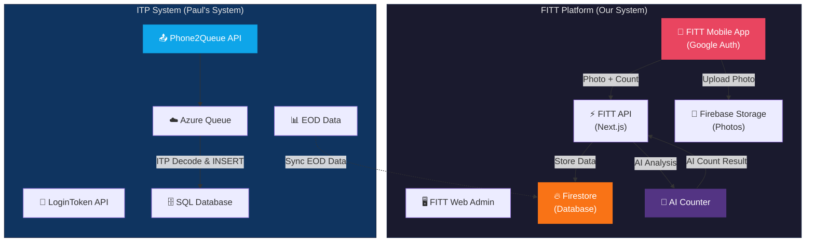
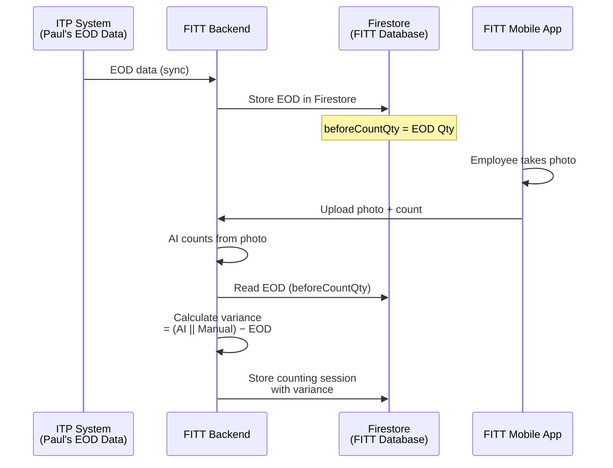
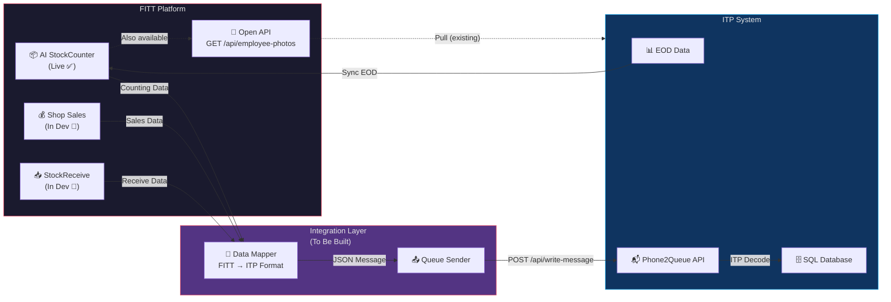
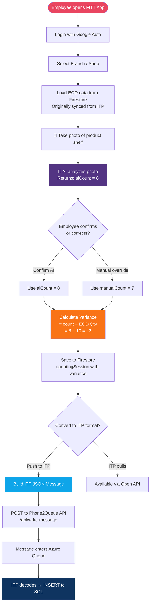
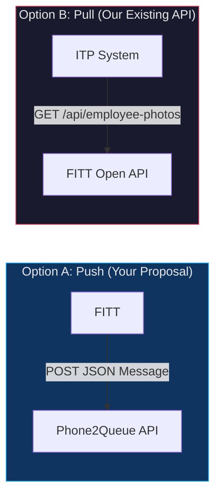
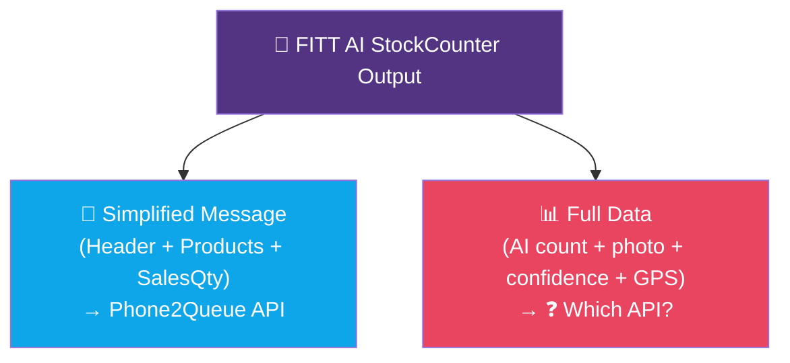

# FITT System — Current Data Architecture & Integration Clarification

**From:** Digital Value Development Team
**To:** Paul Leong 
**Date:** June 8, 2026
**Subject:** Clarification on PhoneApp API Integration — Current System Overview & Open Questions

---

## 1. Purpose of This Document

We have reviewed the documents you shared:
- **PhoneApp to API Interfacing Guide (Rev 2)** — Three-form message system (Shop Sales, Shop Stockcount, Shop StockReceive)
- **Phone2QueueOffline EOD User Manual** — End-user manual with EOD inventory support

This document summarizes **what our current FITT system looks like**, **what data we already have available**, **what we are building**, and **the questions we need answered** before we can proceed with integration.

---

## 2. Our Current System Overview (FITT Platform)

### 2.1 Authentication
| Item | Details |
|---|---|
| **Auth Provider** | Google Authentication (Firebase Auth) |
| **Login Method** | Google Account sign-in (OAuth 2.0) |
| **User Identity** | Firebase UID + Google email |
| **Session** | Firebase ID Token (auto-refresh) |

> [!IMPORTANT]
> Our system uses **Google Authentication**, not username/password login. Our employees sign in with their Google accounts. This is **different from your LoginToken API** which requires `username` + `password` to obtain a JWT token.

### 2.2 System Architecture Overview



### 2.3 Data We Currently Capture (Counting Sessions / AI StockCounter)

When an employee performs a product count at a branch (shop), our system captures the following data:

| Data Field | Description | Example |
|---|---|---|
| `productId` | Product SKU code | `SK-SI-019` |
| `productName` | Product description | `NestMe Birdnest Age Delay Lifting Mask 25 ml` |
| `barcode` (productSKU) | Product barcode | `8859109895190` |
| `aiCount` | Quantity counted by AI (from photo) | `5` |
| `aiConfidence` | AI confidence score (0–1) | `0.95` |
| `manualCount` | Quantity counted manually by employee | `5` |
| `finalCount` | Final confirmed count | `5` |
| `standardCount` | Expected standard quantity | `6` |
| `beforeCountQty` | Previous count / EOD quantity (**synced from ITP**) | `0` |
| `currentCountQty` | Current count quantity | `5` |
| `variance` | Difference: (AI or ManualCount) − EOD Qty | `-1` |
| `discrepancy` | Absolute difference | `1` |
| `imageUrl` | Photo taken by employee (Firebase Storage URL) | `https://firebasestorage.googleapis.com/...` |

**Additional metadata we capture:**
- **Employee info:** userId, userName, userEmail, fullName, baCode (BA/Employee ID)
- **Branch info:** branchId, branchCode, branchName, companyId
- **Location:** GPS coordinates (latitude, longitude) from photo watermark
- **Status:** `completed`, `pending-review`, `approved`, `rejected`, `mismatch`, etc.
- **Period:** periodId (e.g., `2026-05-H1`), periodMonth, periodHalf
- **Timestamps:** createdAt, updatedAt
- **Device:** deviceInfo, appVersion

### 2.4 EOD Data — Already Synced From ITP

> [!NOTE]
> We **already pull EOD data from your (ITP) system** and store it in our Firestore database. Our system continuously syncs this data whenever there are changes.



**How it works:**
1. EOD data is synced from ITP into our Firestore (`beforeCountQty`)
2. Employee takes a photo of the product shelf
3. AI analyzes the photo and returns a count
4. System calculates: `variance = (AI Count or Manual Count) − EOD Qty`
5. Result is stored as a counting session

This means **our variance calculation is already aligned with your Stockcount variance** (`Physical Count − EOD Qty`).

### 2.5 Our Variance Calculation

```
variance = (AI Count or Manual Count) − EOD Qty (from ITP, synced to Firestore)
```

**Example:**
- EOD Qty (beforeCountQty, from ITP) = 10
- AI counts from photo = 8
- Variance = 8 − 10 = **−2** (2 units short)

### 2.6 Modules — Current Status

| Module | Status | Description |
|---|---|---|
| **AI StockCounter** (📦) | ✅ **Live** | Employee takes photo → AI counts → variance calculated against EOD |
| **Shop Sales** (💰) | 🔨 **In Development** | Recording sales quantities (SSOLDQty, SPSOLDQty, MarketingQty) |
| **Shop StockReceive** (📥) | 🔨 **In Development** | Recording stock receiving with transfer numbers |

---

## 3. Existing Open API (Already Available for Pull)

We **already have a REST API** that exposes our counting session data. External systems can pull data from us:

| Item | Details |
|---|---|
| **Endpoint** | `GET /api/employee-photos` |
| **Authentication** | `X-API-Key` header |
| **Format** | JSON |
| **Documentation** | OpenAPI 3.1.0 spec available |
| **Environments** | Production: `https://app.fittbsa.com` / Sandbox: `https://uat-app.fittbsa.com` |

**Available Filters:** branch_code, branch_name, product_id, barcode, status, date range, period_id, user_id, pagination (limit + offset)

**Sample Response (simplified):**
```json
{
  "success": true,
  "data": [
    {
      "id": "abc123def456",
      "imageUrl": "https://firebasestorage.googleapis.com/...",
      "employee": {
        "userId": "AbeseeuQlNW05SZg2ufkp9Fqqfy1",
        "userName": "Watthachai Taechalue",
        "baCode": "BA001"
      },
      "branch": {
        "branchCode": "597",
        "branchName": "วัตสันสาขาเพชรไพบูลย์(597)"
      },
      "product": {
        "productId": "SK-SI-019",
        "productName": "NestMe Birdnest Age Delay Lifting Mask 25 ml",
        "barcode": "8859109895190"
      },
      "counting": {
        "aiCount": 5,
        "manualCount": 5,
        "finalCount": 5,
        "standardCount": 6,
        "beforeCountQty": 6,
        "variance": -1
      },
      "timestamps": {
        "createdAt": "2026-05-25T04:47:21.000Z",
        "updatedAt": "2026-05-25T04:47:29.000Z"
      }
    }
  ],
  "meta": { "total": 150, "limit": 50, "offset": 0, "returned": 50 }
}
```

---

## 4. Proposed Integration Flow

### 4.1 Overall Integration Architecture



### 4.2 Data Flow — AI StockCounter to ITP (Pseudo Code)



### 4.3 Pseudo Code — Converting FITT Data to ITP Message

```
// === AFTER a counting session is completed in FITT ===

function convertToITPMessage(countingSession) {

    // 1. Map FITT data to ITP Header
    header = {
        SubmissionID:  generateUUIDv4(),
        FormType:      "Shop Stockcount",
        UserName:      countingSession.employee.userName,
        ShopName:      countingSession.branch.branchName,
        LocationID:    countingSession.branch.branchCode,  // ⚠️ Need mapping confirmation
        Timestamp:     countingSession.timestamps.createdAt,  // ISO 8601
        Notes:         ""
    }

    // 2. Map counting data to ITP Products
    //    Our variance is already calculated: (AI || Manual) − EOD
    products = [{
        SelectedProduct:    countingSession.product.productId,
        ProductDescription: countingSession.product.productName,
        ProductBarcode:     countingSession.product.barcode,
        SalesQty:           countingSession.counting.variance,  // Already = count − EOD
        TestQty:            0,
        MarketingQty:       0
    }]

    // 3. Build final message
    return {
        message: {
            Header:   header,
            Products: products
        }
    }
}

// === SEND to ITP Queue ===

function sendToITP(itpMessage, jwtToken) {
    POST "https://phone2queue-{id}.azurewebsites.net/api/write-message"
    Headers: {
        "Content-Type": "application/json",
        "Authorization": "Bearer " + jwtToken
    }
    Body: itpMessage

    // Handle response
    if response.success AND response.write_status == "COMPLETE"
        → Both queues received ✅
    else if response.success AND response.write_status == "PARTIAL"
        → At least one queue received ⚠️
    else
        → Error, retry with backoff ❌
}
```

---

## 5. Data Mapping Summary

### 5.1 For Shop Stockcount (📦) — AI StockCounter Data

| ITP Field (Your Format) | FITT Field (Our Data) | Status | Notes |
|---|---|---|---|
| `Header.UserName` | `employee.userName` | ✅ Available | |
| `Header.ShopName` | `branch.branchName` | ✅ Available | |
| `Header.LocationID` | `branch.branchCode` | ⚠️ Need confirmation | Is your LocationID = our branchCode? |
| `Header.Timestamp` | `timestamps.createdAt` | ✅ Available | ISO 8601 format |
| `Products[].SelectedProduct` | `product.productId` | ✅ Available | SKU code |
| `Products[].ProductDescription` | `product.productName` | ✅ Available | |
| `Products[].ProductBarcode` | `product.barcode` | ✅ Available | |
| `Products[].SalesQty` | `counting.variance` | ✅ Available | Already = (AI\|\|Manual) − EOD |
| `Products[].TestQty` | — | ⚠️ Default 0 | We don't capture this separately |
| `Products[].MarketingQty` | — | ⚠️ Default 0 | We don't capture this separately |

### 5.2 For Shop Sales (💰) — In Development 🔨

| ITP Field | FITT Field | Status |
|---|---|---|
| `Products[].SSOLDQty` | (new field) | 🔨 Building |
| `Products[].SPSOLDQty` | (new field) | 🔨 Building |
| `Products[].MarketingQty` | (new field) | 🔨 Building |

### 5.3 For Shop StockReceive (📥) — In Development 🔨

| ITP Field | FITT Field | Status |
|---|---|---|
| `Header.TransferNumber` | (new field) | 🔨 Building |
| `Products[].SalesQty` | (new field) | 🔨 Building |

---

## 6. Questions That Need Clarification

### Q1: ShopCount vs StockCount — Is This the Same Module?

In our previous meeting, we discussed the **"StockCounting" module** — which is about employees counting inventory at branches using our AI StockCounter (photo → AI count → variance).

Your documents describe a **"Shop Stockcount"** form that calculates **variance (Physical Count − EOD Qty)** and sends it to a queue.

**Are these the same thing?** Specifically:
- Is your **"Shop Stockcount"** the same module as what we discussed as **"StockCounting"** in the meeting?
- Or is **"Shop Stockcount"** a separate/different module within ITP?

### Q2: Integration Approach — Push or Pull?



| Approach | How It Works | Pros | Cons |
|---|---|---|---|
| **A. Push** | Our system sends JSON messages to your Phone2Queue API | Real-time delivery | We need JWT auth, message format, retry logic |
| **B. Pull** | Your ITP pulls from our API (`GET /api/employee-photos`) | Already built & tested; simple `X-API-Key` auth | You build data mapping on your side |
| **C. Both** | Push for real-time + Pull for reconciliation | Best coverage | More complexity |

**Which approach do you prefer?**

### Q3: Authentication for Push

If we go with Push, how should our backend authenticate with your LoginToken API?
- Our employees use **Google accounts** (not username/password)
- Should you create a **service account** or **system-level credentials** for our backend?

### Q4: Which Data Do You Actually Need From Us?

| Form | Do You Need This From Us? | Our Status |
|---|---|---|
| **Shop Stockcount** (📦) | ❓ Please confirm | ✅ Live — AI StockCounter with variance |
| **Shop Sales** (💰) | ❓ Please confirm | 🔨 In Development |
| **Shop StockReceive** (📥) | ❓ Please confirm | 🔨 In Development |

### Q5: LocationID Mapping

Your system uses `LocationID` (e.g., `ST062`, `WL 673`). Our system uses `branchCode` (e.g., `597`).
- Are these the same identifiers?
- If not, do you have a mapping table?

### Q6: EOD Data — Already Synced

We **already sync EOD data from your (ITP) system** into our Firestore and use it as `beforeCountQty` for variance calculation.
- Is this the correct EOD data source for integration?
- Or must we re-fetch from your LoginToken API's `eodData[]` response?

### Q7: API for AI StockCounter Data (POST)

Our AI StockCounter module produces **counting data with photos and AI analysis** — data that goes beyond what your Phone2Queue message format includes (e.g., AI confidence scores, photo URLs, GPS location).

**Does ITP have an API endpoint to receive this type of enriched data?**

Or should we only send the simplified Phone2Queue message format (Header + Products with quantities)?



---

## 7. Proposed Next Steps

1. **Please review this document** and answer questions Q1–Q7
2. **Schedule a quick alignment call** to confirm the integration approach
3. Once confirmed, we can estimate development effort and timeline
4. Begin implementation

We want to make sure the integration is done correctly and smoothly. Looking forward to your feedback.

---

**Best Regards,**
Digital Value
